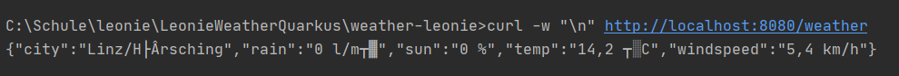
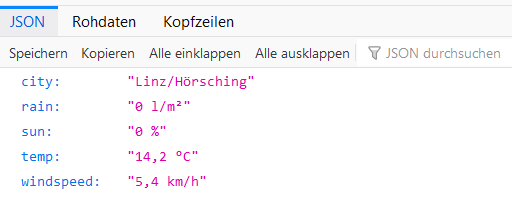

# LeonieWeatherQuarkus

 To use the Weatherplugin for Leonie, it has to be with Quarkus. 
 To run the project, first you have to start it in the Terminal with: ./mvnw compile quarkus:dev  
 If you have a Windows-Machine you have to start it in the Terminal with: .\mvnw compile quarkus:dev  
 To get the weatherdata you can write in the Terminal: curl -w "\n" http://localhost:8080/weather
 
 or you go in the Browser to the url "localhost:8080/weather".
 

